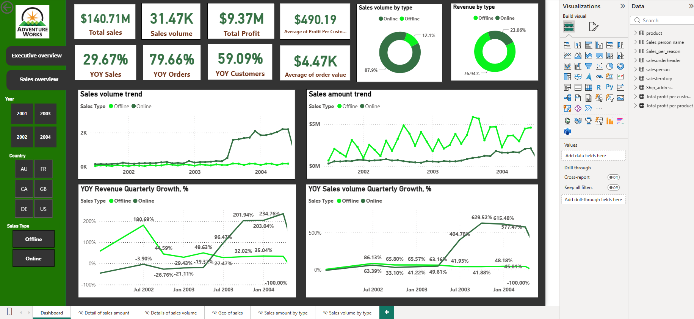

# AdventureWorks Sales Performance Dashboard

An interactive Power BI dashboard analyzing sales, revenue, and profitability for AdventureWorks, a global bike and accessories manufacturer. Built as part of the Data Analytics sprint at Turing College.

## Overview

Sales and finance leadership need a fast, visual way to track performance across regions, product categories, and sales channels — without digging through raw tables. This dashboard consolidates AdventureWorks' order data into two focused views: a high-level **Executive Overview** for KPI monitoring and trend analysis, and a **Sales Overview** for deeper drill-down into products, territories, and sales reps.

## Dashboard Preview

### Executive Overview
KPIs, top-performing products, sales by territory, and sales reasons at a glance.

### Sales Overview
YoY growth trends for revenue, sales volume, orders, and customers, split by online/offline channel.

## Key Features

- **Executive KPI summary** — total sales, sales volume, total profit, and average profit margin
- **YoY growth tracking** — revenue, sales volume, orders, and customer growth by quarter
- **Channel comparison** — online vs. offline performance across every metric
- **Geographic breakdown** — sales by country and territory (US, Canada, UK, Australia, France, Germany)
- **Product performance** — most profitable products and top sellers by volume and revenue
- **Interactive filtering** — slice by year, country, sales type, and sales person
- **Drill-through pages** — dedicated detail views for sales amount, sales volume, and geography

## Tech Stack

- **Power BI Desktop** — data modeling, DAX measures, and report design
- **Google BigQuery** — cloud data warehouse hosting the AdventureWorks dataset
- **SQL** — querying and shaping the source tables before import

## Data Source

Data was queried from the [AdventureWorks dataset on Google BigQuery](https://console.cloud.google.com/bigquery?project=tc-da-1&ws=!1m4!1m3!3m2!1stc-da-1!2sadwentureworks_db) using SQL, then imported into Power BI for modeling and visualization. AdventureWorks is Microsoft's well-known sample dataset simulating a multinational bike manufacturer, covering sales orders, products, customers, and sales territories from 2001–2004.

## How to Use

1. Clone or download this repository
2. Open `Turing-sprint2-v4_0__.pbix` in [Power BI Desktop](https://www.microsoft.com/en-us/power-platform/products/power-bi/downloads)
3. If prompted, update the BigQuery data source connection to your own credentials to refresh the data
4. Use the slicers (Year, Country, Sales Type, Sales Person) to explore the dashboard

## Project Status

✅ Finished — built as a course project for Turing College's Data Analytics program.

## Author

Hossein Bagherpour
